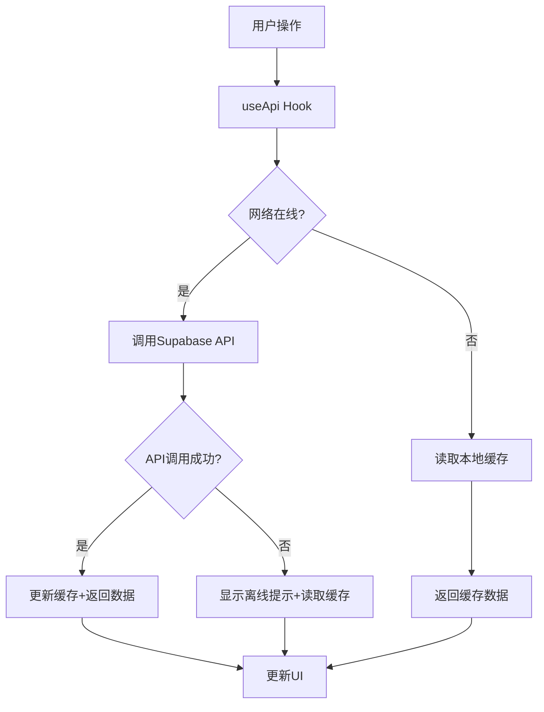

## Product Overview

为现有个人网站项目实现离线模式功能，确保在网络不稳定或API调用失败时仍能访问数据，提升用户体验。

## Core Features

- 优先使用最新在线数据策略
- API调用失败时自动回退到缓存数据
- 实时网络状态检测与监听
- 持久化缓存管理（使用IndexedDB）
- 离线状态UI提示组件
- 缓存过期策略管理
- 请求重试机制

## Tech Stack

- 前端框架：React + TypeScript
- 状态管理：React Hooks
- 网络状态检测：navigator.onLine + window事件监听
- 持久化存储：IndexedDB (使用Dexie.js封装)
- API调用：基于现有的Supabase API封装
- 样式：Tailwind CSS

## Tech Architecture

### System Architecture

- 架构模式：策略模式（在线优先/离线回退）
- 组件结构：App组件 → 网络状态监听器 → 数据获取层 → UI组件



### Module Division

- **网络状态模块**：监听在线/离线状态变化，提供全局状态
- **缓存服务模块**：封装IndexedDB操作，提供读写、过期管理接口
- **API Hook增强模块**：扩展useApi支持自动重试、缓存回退逻辑
- **UI提示模块**：离线状态横幅组件

### Data Flow

用户请求 → 检查网络状态 → 尝试API请求 → 成功则更新缓存并返回 → 失败则读取缓存并显示离线提示

## Implementation Details

### Core Directory Structure

```
project-root/
├── src/
│   ├── hooks/
│   │   ├── useApi.ts           # Modified: 增强离线模式支持
│   │   ├── useCache.ts         # Modified: 增加持久化逻辑
│   │   └── useNetworkStatus.ts # New: 网络状态监听
│   ├── services/
│   │   └── cacheService.ts     # New: IndexedDB缓存服务
│   └── components/
│       └── NetworkStatus.tsx   # New: 离线状态提示组件
```

### Key Code Structures

**CacheService类**：封装IndexedDB操作，提供类型安全的缓存管理

```typescript
class CacheService {
  async get<T>(key: string): Promise<T | null>;
  async set<T>(key: string, value: T, ttl?: number): Promise<void>;
  async has(key: string): Promise<boolean>;
  async clear(): Promise<void>;
}
```

**useNetworkStatus Hook**：提供实时网络状态

```typescript
function useNetworkStatus(): {
  isOnline: boolean;
  lastOnlineTime: number;
};
```

**增强的useApi Hook**：实现在线优先、离线回退策略

```typescript
function useApi<T>(queryFn: () => Promise<T>, options?: {
  cacheKey?: string;
  cacheTTL?: number;
  retryCount?: number;
});
```

### Technical Implementation Plan

#### 网络状态检测

1. **问题**：需要实时检测用户网络连接状态
2. **方案**：使用navigator.onLine和window online/offline事件
3. **技术**：React Context + Events
4. **步骤**：

- 创建NetworkStatusProvider
- 监听online/offline事件
- 提供全局状态访问

5. **测试**：模拟断网/联网场景验证状态更新

#### 持久化缓存

1. **问题**：LocalStorage容量小，需要更大容量的持久化存储
2. **方案**：使用IndexedDB，通过Dexie.js简化操作
3. **技术**：Dexie.js
4. **步骤**：

- 初始化IndexedDB数据库
- 封装get/set/has/clear方法
- 实现TTL过期检查

5. **测试**：验证数据读写和过期机制

#### API增强

1. **问题**：现有useApi不支持离线回退
2. **方案**：增强useApi，添加重试和缓存回退逻辑
3. **技术**：React Hooks + Promise重试
4. **步骤**：

- 集成cacheService
- 实现请求-缓存-回退流程
- 添加请求重试机制

5. **测试**：模拟API失败场景验证回退逻辑

### Integration Points

- **useCache**：复用现有缓存逻辑，扩展持久化能力
- **useApi**：增强现有API调用，添加离线模式
- **Supabase API**：保持现有API调用接口不变
- **全局状态**：通过Context传递网络状态

## Technical Considerations

### Logging

- 记录API调用失败和缓存命中情况
- 记录网络状态变化事件

### Performance Optimization

- 使用内存缓存减少IndexedDB读取
- 防抖网络状态变化事件
- 缓存数据压缩存储

### Security Measures

- 敏感数据不缓存
- 缓存数据加密（可选）
- 验证缓存数据完整性

### Scalability

- 支持动态调整缓存容量
- 支持不同接口配置不同的TTL
- 易于扩展其他缓存策略

## Design Style

离线状态提示采用简洁明了的设计，确保用户在任何页面都能清晰看到网络状态变化。使用固定定位的横幅或Toast通知，不干扰主要内容展示。

## UI Components

### 网络状态横幅 (NetworkStatus)

- **位置**：页面顶部固定
- **在线状态**：不显示或显示半透明绿色条
- **离线状态**：显示醒目的黄色/橙色横幅，包含图标和文字提示
- **动画**：状态切换时有平滑的淡入淡出效果
- **交互**：可关闭，关闭后在会话期间不再提示

### 设计细节

- 使用Tailwind CSS实现响应式设计
- 图标使用SVG或Icon库
- 配色方案遵循网站现有设计系统
- 支持暗色模式适配

## Agent Extensions

### SubAgent

- **code-explorer**
- Purpose: 探索现有项目中useCache和useApi的实现代码，了解当前架构和数据流
- Expected outcome: 获取现有hooks的代码结构、接口定义和使用方式，为增强离线功能提供基础