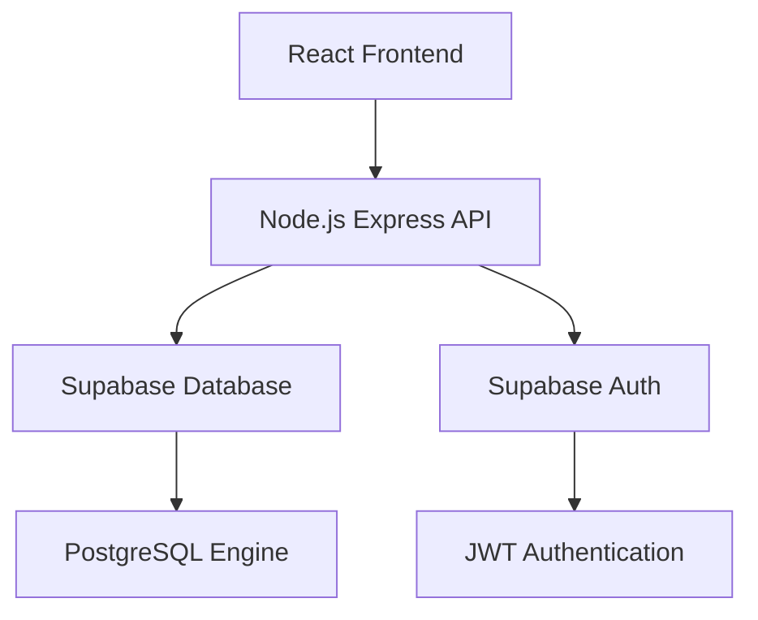

## Product Overview

将个人网站的数据库从MySQL迁移到Supabase，修复前后端功能，并进行性能和用户体验优化

## Core Features

- 数据库迁移：将现有MySQL数据结构迁移到Supabase PostgreSQL
- 后端API重构：修改Node.js后端以适配Supabase数据库连接
- 前端数据层更新：调整React前端以支持新的数据接口
- 性能优化：利用Supabase特性提升数据查询效率
- 用户体验改进：优化页面加载速度和交互响应
- 部署配置更新：调整云服务器部署配置以支持新的技术栈

## Tech Stack

- 前端：React + TypeScript + Tailwind CSS
- 后端：Node.js + Express.js
- 数据库：Supabase (PostgreSQL)
- 数据库迁移工具：Supabase CLI
- API客户端：Supabase JavaScript客户端
- 部署：腾讯云服务器 + CloudBase集成

## System Architecture

## Module Division

- **数据库模块**：使用Supabase CLI进行数据迁移和表结构管理
- **认证模块**：集成Supabase Auth替代原有认证系统
- **API模块**：重构Express路由以使用Supabase客户端
- **前端状态管理**：调整Context/Redux以适配新的数据流

## Data Flow

## Design Style

采用现代化设计风格，优化用户体验。使用React + TypeScript + Tailwind CSS + shadcn/ui构建响应式界面，集成Supabase实时功能增强交互体验。

## Agent Extensions

### Integration

- **tcb** (CloudBase)
- Purpose: 利用CloudBase的数据库、云函数、存储和认证服务与Supabase进行对比和集成
- Expected outcome: 实现Supabase与CloudBase的无缝集成，优化部署和存储方案
- **lighthouse** (Lighthouse)
- Purpose: 进行网站性能评估和优化建议
- Expected outcome: 提升网站性能指标，确保迁移后的性能表现