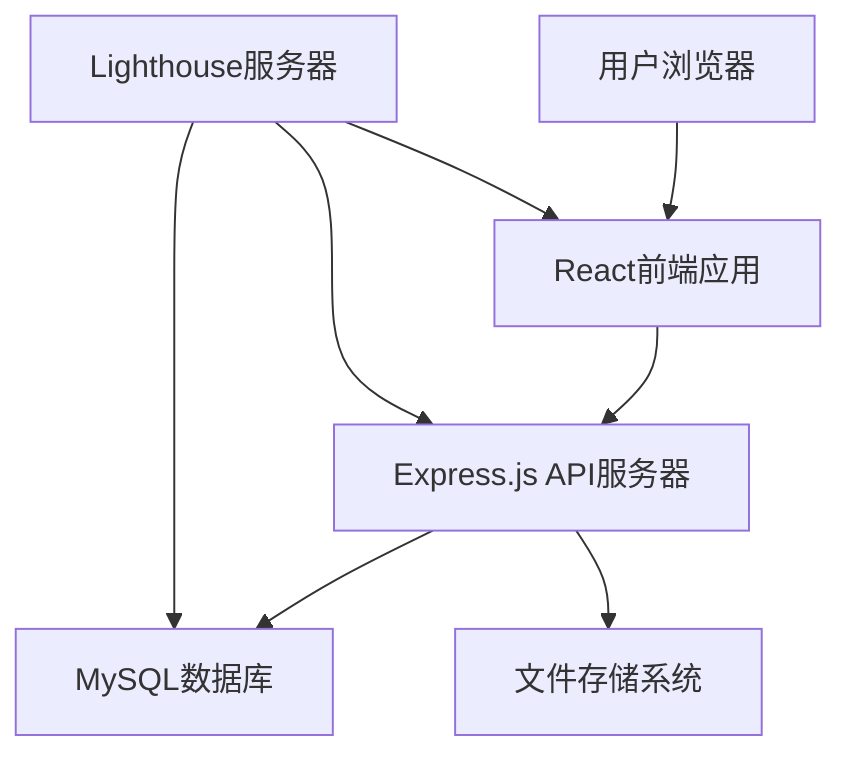
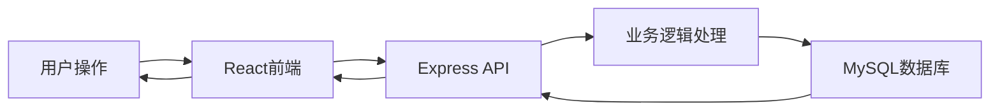

## Product Overview

基于React+Node.js+MySQL技术栈的简约高级风格个人网站，包含自我介绍、互动问答和个人博客三大核心版块，支持腾讯云Lighthouse服务器部署。

## Core Features

- **自我介绍版块**：个人基本信息展示、技能专长、工作经历时间线、联系方式
- **互动问答版块**：用户提问功能、AI智能回答、问答历史记录、点赞收藏功能
- **个人博客版块**：文章分类展示、详细内容浏览、搜索功能、评论互动系统

## Tech Stack

- **前端**：React + Vite + TypeScript + Tailwind CSS
- **后端**：Node.js + Express.js
- **数据库**：MySQL
- **部署**：腾讯云Lighthouse服务器

## System Architecture



## Module Division

- **前端模块**：React组件化架构，包含路由管理、状态管理、UI组件库
- **后端模块**：RESTful API设计，用户认证、内容管理、问答处理
- **数据库模块**：用户表、博客文章表、问答表、评论表设计
- **部署模块**：Nginx反向代理、PM2进程管理、SSL证书配置

## Data Flow



## Implementation Details

### Core Directory Structure

```
personal-website/
├── frontend/                 # React前端项目
│   ├── src/
│   │   ├── components/      # 可复用组件
│   │   ├── pages/           # 页面组件
│   │   ├── hooks/           # 自定义Hooks
│   │   ├── services/        # API服务
│   │   ├── utils/           # 工具函数
│   │   └── types/           # TypeScript类型
│   └── public/              # 静态资源
├── backend/                  # Node.js后端项目
│   ├── src/
│   │   ├── controllers/     # 控制器
│   │   ├── models/          # 数据模型
│   │   ├── routes/          # 路由定义
│   │   ├── middleware/      # 中间件
│   │   ├── config/          # 配置文件
│   │   └── utils/           # 工具函数
│   └── package.json
└── deploy/                   # 部署配置文件
    ├── nginx.conf
    └── ecosystem.config.js
```

### Key Code Structures

```typescript
// 前端主要组件结构
interface BlogPost {
  id: string;
  title: string;
  content: string;
  category: string;
  createdAt: Date;
  tags: string[];
}

interface QAItem {
  id: string;
  question: string;
  answer: string;
  likes: number;
  createdAt: Date;
}

// 后端API端点
GET    /api/blogs          // 获取博客列表
GET    /api/blogs/:id      // 获取单篇博客
POST   /api/qa             // 提交问题
GET    /api/qa             // 获取问答列表
GET    /api/profile        // 获取个人信息
```

## Technical Considerations

### Performance Optimization

- React代码分割和懒加载
- 图片压缩和CDN加速
- API响应缓存机制
- 数据库查询优化

### Security Measures

- API接口参数验证
- SQL注入防护
- XSS攻击防护
- HTTPS加密传输

### Scalability

- 模块化架构设计
- 数据库索引优化
- 静态资源分离
- 负载均衡准备

## 设计风格

采用简约高级的现代设计风格，以黑白灰为主色调，搭配少量强调色。界面布局简洁有序，注重留白和排版层次，通过微动效和过渡动画提升用户体验。整体设计追求专业、现代、优雅的视觉效果，突出个人品牌形象。

## 页面规划

1. **首页**：个人信息概览、最新博客、精选问答
2. **关于我**：详细自我介绍、技能展示、经历时间线
3. **博客**：文章列表、分类筛选、搜索功能
4. **问答**：问题提交、问答展示、互动功能
5. **文章详情**：完整文章内容、评论系统、相关推荐

## Agent Extensions

### SubAgent

- **code-explorer**
- Purpose: 用于搜索和分析现有项目代码结构，了解当前文件组织
- Expected outcome: 获取项目整体架构信息，为开发计划提供基础

### Integration

- **lighthouse** (status: connected)
- Purpose: 部署应用到腾讯云Lighthouse服务器
- Expected outcome: 成功部署个人网站到云端，实现线上访问