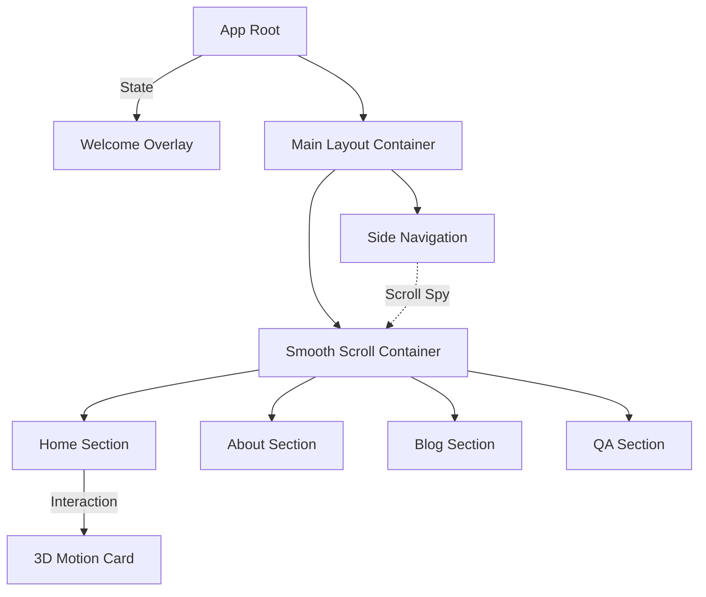

## 产品概述

将现有的React多页面个人网站改造为具有电影级视觉体验的单页滚动应用。核心改造包括：创建沉浸式樱花视频欢迎页、重构页面内容为连续滚动结构、实现高性能的滚动交互动画，并优化整体性能与响应式体验。

## 核心功能

- **沉浸式欢迎页**：使用本地樱花视频作为全屏背景，叠加半透明磨砂遮罩，配合文字淡入淡出动画；用户点击按钮后，欢迎页向上滑出并过渡至主内容区。
- **单页滚动架构**：将Home、About、Blog、QA四个独立页面整合为一个页面的四个Section，使用CSS Scroll Snap或平滑滚动库实现流畅切换。
- **侧边导航系统**：实现侧边固定悬浮导航栏，包含圆形指示点和文字标签；根据滚动位置自动高亮当前所属Section，并支持点击快速跳转。
- **交互式视觉体验**：集成滚动触发动画（Scroll Reveal），内容随滚动进入视口时依次上浮显示；为卡片元素添加鼠标悬停3D倾斜视差效果。
- **性能优化**：视频使用懒加载或预加载策略，图片资源实施懒加载，确保首屏加载速度；全站响应式适配移动端。

## 技术栈

- **前端框架**：React + TypeScript
- **样式方案**：Tailwind CSS
- **动画引擎**：Framer Motion（处理过渡、手势和复杂动画）
- **滚动检测**：react-intersection-observer（高性能监听元素可见性）
- **路由管理**：React Router（Hash模式或History模式适配SPA结构）

## 系统架构

### 系统架构图



### 模块划分

- **Core Layout**: 主布局容器，负责页面整体结构、侧边导航定位和滚动容器配置。
- **Welcome Module**: 欢迎页模块，包含视频背景组件、遮罩层和入场/出场动画逻辑。
- **Section Components**: 原有页面的重构版，将Home/About/Blog/QA转化为独立的Section组件，移除独立路由逻辑。
- **Navigation Module**: 侧边导航组件，包含指示点渲染、滚动监听逻辑和高亮状态管理。
- **Animation Hooks**: 自定义Hooks，封装`useInView`和`useAnimation`，提供统一的"当元素可见时播放动画"能力。

### 数据流

用户交互(点击/滚动) -> 事件触发 -> 更新React State(useViewportScroll/useState) -> 触发Framer Motion动画值变化 -> 渲染层更新 -> 视觉反馈。

## 实现细节

### 核心目录结构

```
project-root/
├── src/
│   ├── components/
│   │   ├── WelcomeOverlay/       # 新增：欢迎页组件
│   │   │   ├── index.tsx
│   │   │   └── VideoBackground.tsx
│   │   ├── SideNavigation/       # 新增：侧边导航
│   │   │   ├── index.tsx
│   │   │   └── NavDot.tsx
│   │   ├── sections/             # 新增：页面内容区块
│   │   │   ├── HomeSection.tsx   # 由Home改造
│   │   │   ├── AboutSection.tsx  # 由About改造
│   │   │   ├── BlogSection.tsx   # 由Blog改造
│   │   │   └── QASection.tsx     # 由QA改造
│   │   └── ui/                   # 通用UI组件(卡片等)
│   │       └── TiltCard.tsx      # 新增：3D卡片
│   ├── hooks/
│   │   └── useScrollAnimation.ts # 新增：滚动动画Hook
│   ├── App.tsx                   # 修改：主入口
│   └── main.tsx
```

### 关键技术实现

1. **视频欢迎页**：使用HTML5 `<video>` 标签设置为 `object-fit: cover`，利用 `Framer Motion` 的 `AnimatePresence` 处理组件卸载时的滑出动画。
2. **平滑滚动**：使用 CSS `scroll-behavior: smooth` 或 `framer-motion` 的 `useScroll` 绑定容器滚动位置实现更细腻的控制。
3. **3D卡片**：监听 `mousemove` 事件，计算鼠标相对于卡片中心的偏移量，动态应用 `transform: perspective(1000px) rotateX(...) rotateY(...)`。

## 设计风格

采用**沉浸式极简主义**结合**玻璃拟态**风格。背景以深色为主，突出樱花视频的亮色元素。UI组件采用半透明磨砂玻璃效果，配合细腻的微交互动画，营造高端电影感。

## 设计内容

- **欢迎页**：全屏视频背景，叠加深色渐变遮罩，确保文字可读性。中心文字使用衬线体展示标题，具有淡入上浮动画。底部设有"Enter Site"按钮，设计为发光线条样式。
- **主页面布局**：顶部保留简洁Logo，右侧（或左侧）悬浮固定导航球。Section之间保持充足间距，背景色交替微调或保持统一深色。
- **卡片设计**：Blog和QA部分的卡片采用轻玻璃拟态，悬停时边框发光并伴随3D倾斜效果。
- **响应式**：移动端隐藏侧边导航，改为底部固定导航栏；字体大小和间距自适应调整。

## Agent Extensions

### SubAgent

- **code-explorer**
- Purpose: Analyze the current project structure in `c:/Users/28945/Desktop/个人网站重制版`, identifying the existing Home, About, Blog, and QA page components and routing logic.
- Expected outcome: Clear mapping of current file locations and component structures to plan the refactoring into sections.